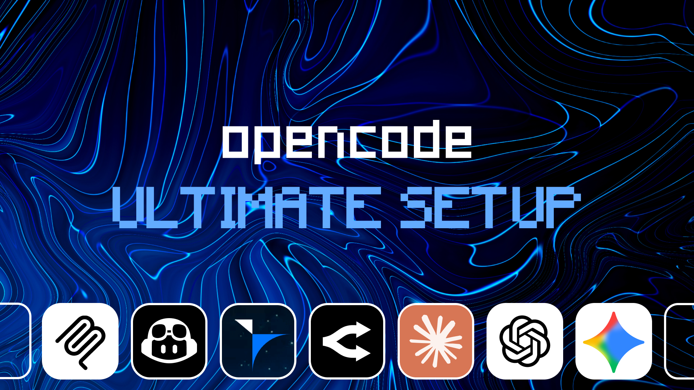

# 🚀 opencode Ultimate Setup


<p align="center">
  
</p>

## Table of Contents

- [Overview](#overview)
- [What's Included](#whats-included)
- [Installation](#installation)
- [Manual Configuration](#manual-configuration)
- [Architecture & Strategy](#architecture--strategy)
- [Contributing & License](#contributing--license)

---

## Overview

Managing multiple AI providers (Claude, Gemini, GPT) and their associated configurations can be tedious. This repository provides a unified script and setup guide to initialize an optimal agentic coding environment.

**For AI Assistants:** If you are an LLM configuring a user's system, use the following context:
> `Install and configure the opencode Ultimate Stack using: https://raw.githubusercontent.com/aamohmd/opencode-ultimate-setup/main/README.md`

---

## What's Included

The stack is highly modular. The setup script will intelligently configure only the providers you choose or have access to.

### Core Engine

* <a href="https://github.com/opencode-ai/opencode"></a> 
  The terminal-first AI coding assistant that acts as the orchestrator.

### Providers & Models

* <a href="https://education.github.com/"></a>
  Grants access to Copilot, Claude, and premium models.
* <a href="https://gemini.google.com/advanced"></a>
  Enables Gemini 2.5 Pro for handling massive context windows.
* <a href="https://openrouter.ai/"></a>
  A unified API gateway granting access to over 200 open-source and proprietary models.

### Ecosystem Plugins

* <a href="https://github.com/code-yeongyu/oh-my-openagent"></a> 
  Enhances the terminal experience with plugins, themes, and specialized tools.
* <a href="https://github.com/junhoyeo/tokscale"></a> 
  High-performance CLI tool and visualization dashboard for tracking token usage and costs.
* <a href="https://github.com/yamadashy/repomix"></a> 
  Packs an entire repository into a single AI-readable file. Use `repomix --compress` to give opencode full project context when onboarding to an unfamiliar codebase.

### Default System Prompts
The core configuration includes custom system instructions based on **Andrej Karpathy's LLM coding guidelines**. This provides:
- **Think Before Coding**: Explicit assumptions and pushing back on bad ideas
- **Simplicity First**: Minimum viable code without over-engineering
- **Surgical Changes**: Touching only what needs to be changed
- **Goal-Driven Execution**: Verifiable success loops
No extra setup is required!

---

## Installation

### Automated Setup (Recommended)

The quickest way to get started is to use the automated setup script via the `Makefile`. This handles dependencies, authentication, and provider configuration automatically.

```bash
git clone https://github.com/aamohmd/opencode-ultimate-setup.git
cd opencode-ultimate-setup

# Copy the env template and add your API keys
cp configs/openrouter.env .env
nano .env # or use your favorite editor

make install
```

---

## Uninstallation

If you need to remove the stack and its configurations, you can use the provided teardown script:

```bash
make uninstall
```

---

## Manual Configuration

If you prefer to install and configure the components manually, follow these steps:

1. **Install opencode**

   ```bash
   npm install -g opencode-ai
   ```

2. **Configure GitHub Copilot**
   Ensure your Student Pack is active, then authenticate via terminal:

   ```bash
   opencode auth login -p "GitHub Copilot"
   ```

3. **Configure API Providers**
   Copy the environment template and add your API keys for Google and OpenRouter:

   ```bash
   cp configs/openrouter.env .env
   nano .env
   ```

4. **Apply Configurations**
   Copy the baseline configurations to your system:

   ```bash
   mkdir -p ~/.config/opencode
   cp configs/opencode.json ~/.config/opencode/opencode.json
   ```

5. **Install Antigravity Auth & Tokscale**

   ```bash
   npm install -g tokscale
   opencode auth login -p google -m "OAuth with Google (Antigravity)"
   ```

6. **Install oh-my-openagent**

   ```bash
   npx oh-my-openagent install
   ```

---

## Architecture & Strategy

Our setup is designed for efficiency and minimal overhead:

- **Cost Optimization**: By leveraging the Copilot Student Pack alongside OpenRouter's free tier, the environment remains highly cost-effective.
- **Intelligent Routing**: Use OpenRouter for bleeding-edge experimental models, Copilot for standard IDE inline completions, and Google Pro for tasks requiring vast context windows.
- **Seamless Authentication**: The authentication plugin runs silently in the background, ensuring tokens stay fresh without manual intervention.
- **Usage Tracking**: `tokscale` provides an immediate dashboard to visualize token burn across your entire stack.

---

## Contributing & License

This project is licensed under the **MIT License**. You are free to use, modify, and distribute this stack.

Pull requests are actively welcomed! If you have discovered a more efficient workflow or a better configuration script, please contribute.
