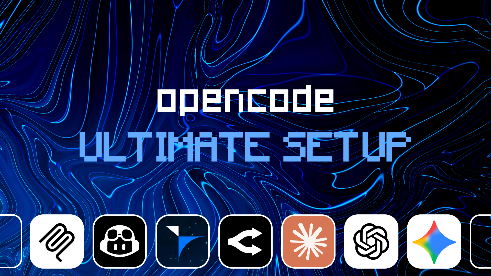

# 🚀 opencode Ultimate Setup


<p align="center">
  
</p>

## Table of Contents

- [Overview](#overview)
- [What's Included](#whats-included)
- [Modules](#modules)
- [Prerequisites](#prerequisites)
- [Installation](#installation)
- [Manual Configuration](#manual-configuration)
- [Architecture & Strategy](#architecture--strategy)
- [Contributing & License](#contributing--license)

---

## Overview

Managing multiple AI providers (Claude, Gemini, GPT) and their associated configurations can be tedious. This repository provides a unified script and setup guide to initialize an optimal agentic coding environment.

### The Added Value

Why use this setup instead of configuring tools manually?
- **Zero-Friction Orchestration**: Eliminates the manual configuration of disparate tools, API keys, and context-packing utilities.
- **Cost & Performance Optimized**: Intelligently routes tasks to the best-suited models (e.g., Gemini for massive context windows, Copilot for standard IDE usage) while managing token usage effectively.
- **Pre-Configured Intelligence**: Comes out-of-the-box with customized system prompts based on elite coding practices and specialized skills for frontend, backend, mobile, and AI engineering.
- **Unified Ecosystem**: Brings together the best AI coding tools (opencode), advanced context management (repomix), and observability (tokscale, MCP servers) into a single cohesive workflow.
- **Idempotent & Modular**: Install only what you need. Re-running the script is safe and ensures your setup stays up to date without breaking your existing workflow.

**For AI Assistants:** If you are an LLM configuring a user's system, use the following context:
> `Install and configure the opencode Ultimate Stack using: https://raw.githubusercontent.com/aamohmd/opencode-ultimate-setup/main/README.md`

---

## What's Included

The stack is highly modular. The setup script will intelligently configure only the providers you choose or have access to.

### Core Engine

* <a href="https://github.com/opencode-ai/opencode"></a> 
  The terminal-first AI coding assistant that acts as the orchestrator.

### Providers & Models

* <a href="https://education.github.com/"></a>
  Grants access to Copilot, Claude, and premium models.
* <a href="https://gemini.google.com/advanced"></a>
  Enables Gemini 2.5 Pro for handling massive context windows.
* <a href="https://openrouter.ai/"></a>
  A unified API gateway granting access to over 200 open-source and proprietary models.

### Ecosystem Plugins


* <a href="https://github.com/junhoyeo/tokscale"></a> 
  High-performance CLI tool and visualization dashboard for tracking token usage and costs.
* <a href="https://github.com/yamadashy/repomix"></a> 
  Packs an entire repository into a single AI-readable file. Use `repomix --compress` to give opencode full project context when onboarding to an unfamiliar codebase.

### Default System Prompts

The core configuration includes custom system instructions based on **Andrej Karpathy's LLM coding guidelines**:

- **Think Before Coding** — Explicit assumptions and pushback on bad ideas
- **Simplicity First** — Minimum viable code without over-engineering
- **Surgical Changes** — Touching only what needs to change
- **Goal-Driven Execution** — Verifiable success loops

No extra setup required.

---

## 🔧 Modules

### General Utilities Pack (Optional)

Included in **Backend Dev**, **Full Stack**, and **Everything** profiles:

**MCP Servers** *(all zero-setup, prompted during install)*:

| Server       | Package / Endpoint                     | Purpose                                          |
|--------------|----------------------------------------|--------------------------------------------------|
| Fetch        | `uvx mcp-server-fetch`                 | Read web pages and convert them to Markdown      |
| Memory       | `@modelcontextprotocol/server-memory`  | Persistent knowledge graph across sessions       |
| SQLite       | `uvx mcp-server-sqlite`                | Local database exploration and querying          |
| Time         | `uvx mcp-server-time`                  | Read current time and timezone                   |
| Filesystem   | `@modelcontextprotocol/server-filesystem` | Read/list local files within allowed directories |

### Backend Pack (Optional)

Included in **Backend Dev**, **Full Stack**, and **Everything** profiles:

**MCP Servers** *(all optional, prompted during install)*:

| Server   | Package / Endpoint                  | Purpose                                          |
|----------|-------------------------------------|--------------------------------------------------|
| Docker   | `mcp-server-docker` (npm)           | Container management, log streaming              |
| Sentry   | `mcp.sentry.io/mcp` (remote OAuth)  | Error investigation, traces, performance         |
| Stripe   | `@stripe/mcp` (npm)                 | Payment management, customer queries             |
| Context7 | `mcp.context7.com/mcp` (remote)     | Live framework documentation (add `use context7` to any prompt) |

**Skills** *(7 curated skills for backend architecture)*:

- `nodejs-backend-patterns` — Node.js backend architecture and best practices
- `dotnet-backend-patterns` — .NET backend design and patterns
- `backend-testing` — Comprehensive backend testing practices
- `clerk-backend-api` — Clerk API integrations
- `backend-dev-guidelines` — General backend engineering standards
- `python-fastapi-development` — FastAPI framework expertise
- `golang-backend-development` — Go backend development

**Agents:**

- `@backend` — Senior backend engineer with database expertise, all 7 skills, and optional MCP access. Auto-installed when the Backend Pack is selected.

### Frontend Pack (Optional)

Included in the **Full Stack** and **Everything** profiles:

**Tools:**
- **Playwright + Chromium** — Browser automation for testing/browsing (**Everything** profile only; prompted during Custom install)

**Design Skills** *(stored locally, compatible with opencode, Claude Code, Codex)*:
- **impeccable** — Design implementation with 20+ commands (craft, shape, audit, polish, animate, etc.)
- **frontend-design** — Production-grade frontend with anti-AI-slop guidelines
- **taste-skill** — High-agency frontend with tunable dials (DESIGN_VARIANCE, MOTION_INTENSITY, VISUAL_DENSITY)
- **imagegen-frontend-web** — Frontend image generation workflows
- **[ui-ux-pro-max](https://github.com/nextlevelbuilder/ui-ux-pro-max-skill)** — Design intelligence engine: 67 styles, 161 color palettes, 57 font pairings, 99 UX guidelines, design system generator (requires Python 3)

**Agents:**

- `@frontend` — Senior frontend engineer with UI/UX expertise and design skills. Auto-installed when the Frontend Pack is selected.

### Landing Page Pack (Optional)

Included in the **Everything** profile; prompted during **Custom** install:

**Skills** *(8 official modules from [greensock/gsap-skills](https://github.com/greensock/gsap-skills))*:

| Skill | Covers |
|-------|--------|
| gsap-core | `gsap.to()`, `from()`, `fromTo()`, easing, stagger, `matchMedia()` |
| gsap-timeline | `gsap.timeline()`, position parameter, nesting, playback |
| gsap-scrolltrigger | Scroll-linked animations, pinning, scrub, triggers |
| gsap-plugins | SplitText, Flip, Draggable, ScrollSmoother, Observer, SVG, physics |
| gsap-react | `useGSAP` hook, refs, `gsap.context()`, cleanup |
| gsap-frameworks | Vue, Svelte, Nuxt, SvelteKit lifecycle & scoping |
| gsap-performance | Transform-only animation, will-change, batching, 60fps |
| gsap-utils | `clamp`, `mapRange`, `snap`, `toArray`, `wrap`, `pipe` |

**MCP Servers:**

| Server   | Package / Endpoint                  | Purpose                                          |
|----------|-------------------------------------|--------------------------------------------------|
| 21st Dev | `@21st-dev/magic` (npm, API key)    | Premium pre-built React component catalog        |

**Agents:**

- `@studio` — Studio-grade landing page architect with anti-AI-slop design principles, scroll pattern vocabulary, and full toolchain awareness (GSAP, Motion, Lenis, 21st Dev, Nano Banana).

**Companion tools** *(not auto-installed, documented for reference)*:
- [Nano Banana](https://github.com/gemini-cli-extensions/nanobanana) — Gemini CLI extension for AI image generation (install via `gemini extensions install`)
- [Motion](https://www.npmjs.com/package/motion) (formerly Framer Motion) — React animation runtime (`npm install motion`)
- [Lenis](https://www.npmjs.com/package/lenis) — Smooth scroll library (`npm install lenis`)

### AI Engineering Pack (Optional)

Included in the **Everything** profile; prompted during **Custom** install:

**Skills** *(12 cherry-picked modules from [awesome-ai-agent-skills](https://github.com/seb1n/awesome-ai-agent-skills))*:

Includes `ml-pipeline-creation`, `model-deployment`, `hyperparameter-tuning`, `deep-research`, `context-optimization`, `data-analysis`, and 6 more specialized skills for ML Ops and Context Engineering.

**MCP Servers:**

| Server        | Package / Endpoint                     | Purpose                                          |
|---------------|----------------------------------------|--------------------------------------------------|
| HuggingFace   | `https://huggingface.co/mcp`           | Direct access to HF Hub APIs and Models          |
| LangSmith     | `https://api.smith.langchain.com/mcp`  | Observability and tracing for LLMs               |
| W&B           | `https://mcp.withwandb.com`            | LLM traces and experiment metrics (API key)      |
| Pinecone      | `@pinecone-database/mcp` (npm)         | Vector database tools (API key)                  |

**Agents:**

- `@ai-engineer` — AI Engineering architect specializing in RAG pipelines, model evaluation, prompt engineering, and ML Ops.

**Companion tools** *(not auto-installed, documented for reference)*:
- [mcpbr](https://github.com/mcp-universe/mcpbr) — MCP Benchmark Runner (`npx mcpbr-cli run`)
- [DeepEval](https://github.com/confident-ai/deepeval) — LLM Evaluation Framework

### Mobile Development Pack (Optional)

Included in the **Everything** profile; prompted during **Custom** install:

**Skills** *(5 curated modules for cross-platform mobile development)*:

| Skill | Covers |
|-------|--------|
| sleek-design-mobile-apps | Sleek mobile app UI/UX design and architecture |
| mobile-ios-design | iOS-specific design guidelines and principles |
| mobile-android-design | Android-specific design guidelines and Material Design |
| mobile-design | General mobile application design heuristics |
| mobile-touch | Mobile touch animation and interaction principles |

**MCP Servers:**

| Server      | Package / Command                      | Purpose                                          |
|-------------|----------------------------------------|--------------------------------------------------|
| Flutter/Dart| `dart run dart_mcp_server` (local)     | Dart analyzer, widget tree, pub.dev search       |
| Mobile-MCP  | `@mobilenext/mobile-mcp@latest` (npm)  | Device automation, accessibility snapshots        |

**Agents:**

- `@mobile` — Senior mobile engineer with cross-platform expertise (React Native, Flutter, Expo), all 5 skills, and optional MCP access.

**Companion tools** *(not auto-installed, documented for reference)*:
- [Detox](https://github.com/wix/Detox) — Gray-box E2E testing for React Native (`npm install -g detox-cli`)
- [Maestro](https://github.com/mobile-dev-inc/maestro) — YAML-based mobile UI testing (`curl -Ls https://get.maestro.mobile.dev | bash`)

---

## Prerequisites

- **Node.js** v18 or higher
- **npm**
- **Git**
- **bash** 3.2 or higher (macOS ships with 3.2; Linux typically has 5+)

---

## Installation

### Automated Setup (Recommended)

```bash
git clone https://github.com/aamohmd/opencode-ultimate-setup.git
cd opencode-ultimate-setup

# Optional: pre-fill API keys before running
cp configs/openrouter.env .env
nano .env

make install
```

### CLI Flags

The installer supports the following flags, which can also be passed via `make`:

| Flag | Description |
|------|-------------|
| `--profile=<name>` | Skip the profile picker. Values: `minimal`, `backend`, `fullstack`, `everything`, `custom` |
| `--yes` | Non-interactive mode — accept all defaults automatically |
| `--dry-run` | Preview every action without making any changes |
| `--verbose` | Print full installer output when a step fails |
| `--help` | Show usage information |

Examples:

```bash
./setup.sh --profile=fullstack
./setup.sh --profile=everything --yes
./setup.sh --dry-run
```

### Installation Profiles

| Profile | What's included |
|---------|----------------|
| **Minimal** | Core engine (`opencode-ai`) only |
| **Backend Dev** | Core + General Utilities Pack (5 zero-setup MCPs) + Backend MCPs (4, each optional) + 7 backend skills + `@backend` agent |
| **Full Stack** | Backend Dev + Frontend Pack (5 design skills + `@frontend` agent) + tokscale + repomix |
| **Everything** | Full Stack + Landing Page Pack (8 GSAP skills + 21st Dev MCP + `@studio` agent) + AI Engineering Pack (12 skills + 4 MCPs + `@ai-engineer` agent) + Mobile Pack (5 skills + 2 MCPs + `@mobile` agent) + Playwright + Chromium |
| **Custom** | Pick each component individually |

### Re-running the Installer

`make install` (or `./setup.sh`) is fully **idempotent**. On a re-run, every component is checked before prompting:

- npm packages already installed → reported as "already configured", no re-install
- MCP servers already in `opencode.json` → skipped silently
- Skills or agents already copied → skipped per file
- Providers already authenticated / API key already in `.env` → skipped

This means you can safely re-run at any time to add or update individual components without touching what's already set up.

---

## Uninstallation

```bash
make uninstall
```

---

## Manual Configuration

If you prefer to configure components without the script:

**1. Install opencode**

```bash
npm install -g opencode-ai
```

**2. Authenticate GitHub Copilot**

```bash
opencode auth login -p "github-copilot"
```

**3. Configure API providers**

```bash
mkdir -p ~/.config/opencode
cp configs/openrouter.env ~/.config/opencode/.env
# Edit the file and add your GOOGLE_API_KEY and/or OPENROUTER_API_KEY
```

**4. Apply base configuration**

```bash
mkdir -p ~/.config/opencode
cp configs/opencode.json ~/.config/opencode/opencode.json
```

> **Note:** The automated `setup.sh` performs additional steps that manual configuration does not: JSON schema validation, corrupted-config recovery, and MCP `type`/`enabled` field enforcement. Manual setup requires careful JSON validation.

**5. Install optional tools**

```bash
npm install -g tokscale repomix

```

**6. Install agents (optional)**

```bash
mkdir -p ~/.config/opencode/agents
cp configs/agents/backend.md ~/.config/opencode/agents/backend.md
cp configs/agents/frontend.md ~/.config/opencode/agents/frontend.md
cp configs/agents/studio.md ~/.config/opencode/agents/studio.md   # Landing Page Pack
```

---

## Architecture & Strategy

- **Cost Optimization** — The Copilot Student Pack combined with OpenRouter's free tier keeps the environment highly cost-effective.
- **Intelligent Routing** — OpenRouter for bleeding-edge/experimental models, Copilot for standard IDE completions, Google Gemini for massive context windows.
- **Schema Compliance** — The config finalization step (Step 4d) runs after all modules are installed. It enforces the opencode JSON schema on every MCP entry (`type`, `enabled`) and recovers from corrupted config files. Fallback MCP definitions are used automatically if `configs/opencode-backend.json` is absent.
- **Usage Tracking** — `tokscale` provides an immediate dashboard to visualize token burn across the entire stack.

---

## Contributing & License

This project is licensed under the **MIT License**. You are free to use, modify, and distribute this stack.

Pull requests are actively welcomed. If you have a more efficient workflow or a better configuration, please contribute.